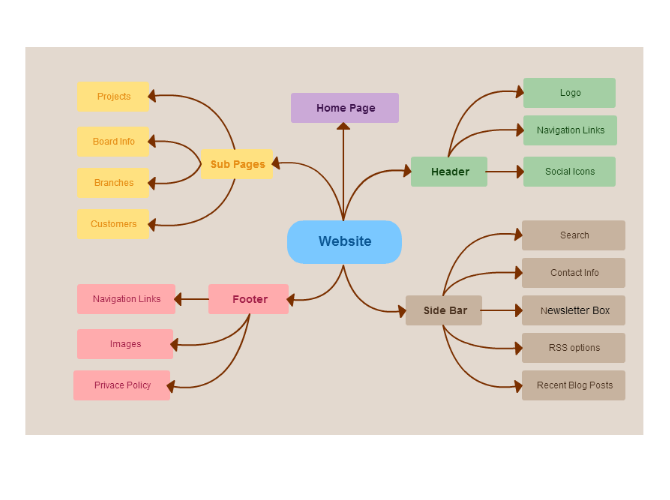

<!-- configuracion de colores es opcional pero ultil-->
<section id="themes">
	<h2>Configuración de temas</h2>
	<p>
		Temas: <br>
		<a href="?#/themes">Default</a> -
		<a href="?theme=sky#/themes">Sky</a> -
		<a href="?theme=beige#/themes">Beige</a> -
		<a href="?theme=simple#/themes">Simple</a> -
		<a href="?theme=serif#/themes">Serif</a> -
		<a href="?theme=night#/themes">Night</a> <br>
		<a href="?theme=moon#/themes">Moon</a> -
		<a href="?theme=solarized#/themes">Solarized</a>
	</p>
</section>

Slide:

# Creación de un perfil de hacker

Jean Pierre Charalambos

Slide:

# Indice

## Objetivos

## Diseño

## Herramientas

Slide:

# Objetivos

## Principal

+ Establecer relaciones al presentarse como hacker

## Específicos

1. Mostrar intereses <!-- .element: class="fragment" data-fragment-index="1"-->
2. Enseñar proyectos <!-- .element: class="fragment" data-fragment-index="2"-->
3. Hacktivismo <!-- .element: class="fragment" data-fragment-index="3"-->
4. Blog <!-- .element: class="fragment" data-fragment-index="4"-->

Note:
Tipos de relación? Colboración, negocios, académicas

Subslide:

## Objetivos
### Ejemplos

* [David Ketcheson](http://www.davidketcheson.info/index.html)
* [Carl Boettiger](http://www.carlboettiger.info/)

Note:
La idea es listar acá perfiles de estudiantes del curso

Slide:

# Diseño



Herramienta: [mindmup](https://www.mindmup.com/)

Slide:

# Herramientas

1. CMS's, [joomla](http://www.joomla.org/), [drupal](https://www.drupal.org/)...
2. Blogs systems, [wordpress](https://wordpress.com/), tumblr, ...
3. Static site generators

Subslide:

## Herramientas
### Static site generators: propiedades

* Ventajas
    1. No DB!<!-- .element: class="fragment" data-fragment-index="1"-->
    2. Seguridad<!-- .element: class="fragment" data-fragment-index="2"-->
    3. Código fuente del sitio<!-- .element: class="fragment" data-fragment-index="3"-->
    4. Blogging desde la consola<!-- .element: class="fragment" data-fragment-index="4"-->
    5. Simple deployment<!-- .element: class="fragment" data-fragment-index="5"-->
    6. Js, ruby, python, bash...<!-- .element: class="fragment" data-fragment-index="6"-->

* Desventajas
    1. Curva de aprendizaje<!-- .element: class="fragment" data-fragment-index="7"-->
    2. Difíciles de configurar la primera vez<!-- .element: class="fragment" data-fragment-index="8"-->

Subslide:

## Herramientas
### Static site generators: herramientas

* Basados en ruby, disponibles en [github pages](https://pages.github.com/)
    * [jekyll](http://jekyllrb.com/), [github repo](https://github.com/jekyll/jekyll)
    * [octopress](http://octopress.org/), [github repo](https://github.com/imathis/octopress)

* Lista completa
    [Static site generators](http://staticsitegenerators.net/)

Subslide:

## Herramientas
### Static site generators: Jekyll

```
gem install jekyll
jekyll new my-awesome-site
cd my-awesome-site
$ jekyll serve
#=> Now browse to http://localhost:4000
```

Subslide:

## Herramientas
### Static site generators: Octopress
#### Instalación

```
# clone repo:
git clone git://github.com/imathis/octopress.git octopress
cd octopress
# install dependencies:
gem install bundler
bundle install
# install the default theme
rake install
```

Subslide:

## Herramientas
### Static site generators: Octopress
#### Blogging

```
rake new_post["Mi caso acerca del bacalao magnífico"]
# escriba su entrada
rake generate
rake preview
```

Ejemplo completo con github pages: [sitio del curso](https://github.com/SoftwareLibre/softwarelibre.github.io/tree/source)

Slide:

# Resources

* [mindmup](https://www.mindmup.com/)
* [Mastering Markdown](https://guides.github.com/features/mastering-markdown/)
* [Github Pages](https://pages.github.com/)
* [jekyll](http://jekyllrb.com/) [github repo](https://github.com/jekyll/jekyll)
* [octopress](http://octopress.org/) [github repo](https://github.com/imathis/octopress)
* [Static site generators](http://staticsitegenerators.net/)